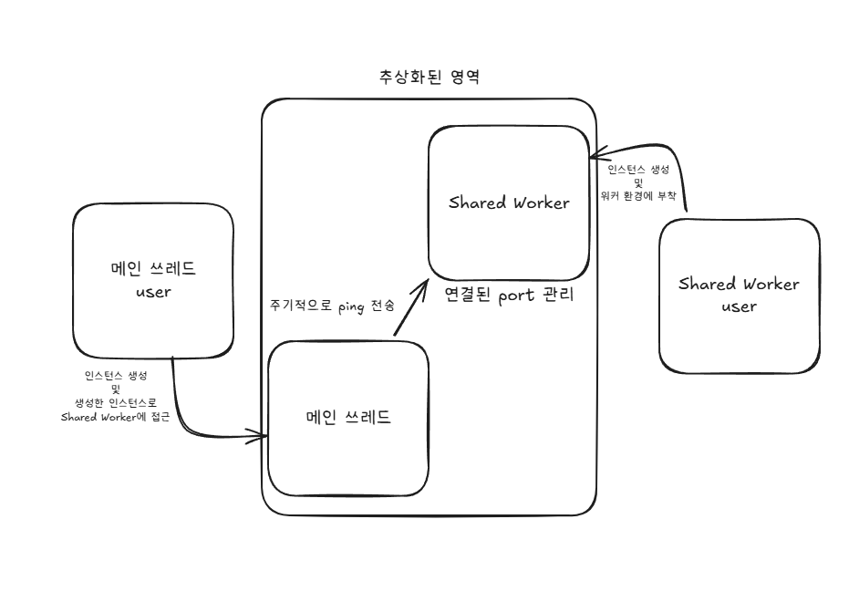

# 여러 탭 혹은 브라우저 창 간 데이터 공유

하나의 탭에서 데이터를 페칭하여도 같은 origin을 가지는 모든 탭 혹은 윈도우 창에서 데이터를 받아 볼 수 있습니다.

고양이와 강아지 사진을 가져오지만 open API를 이용하므로 서버 상태에 따라 느리거나 작동하지 않을 수 있습니다.

SharedWorker로 모든 탭에 데이터를 보내주지만 종료된 탭을 감지할 방법이 따로 없어 주기적으로 ping을 보내어 탭 종료 감지

Shared Worker Inspector (chrome): chrome://inspect/#workers에서 sharedWorker
에서 Shared Worker의 로그 등을 확인 가능

추상화된 Shared Worker는 ts 파일, js 파일은 단순 예시

